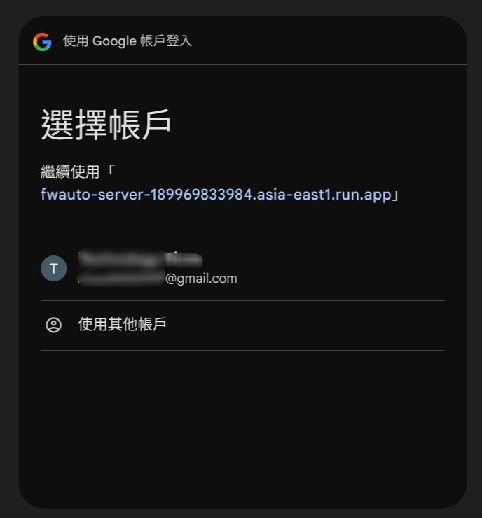
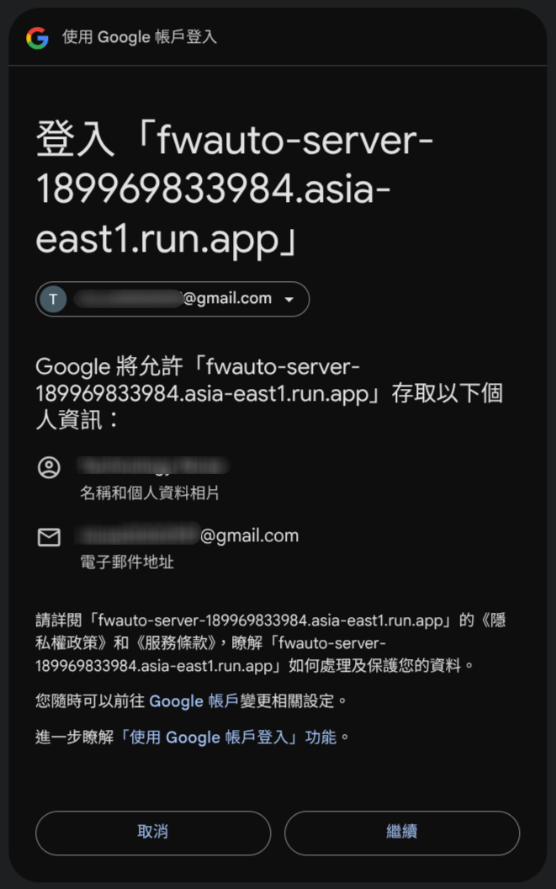
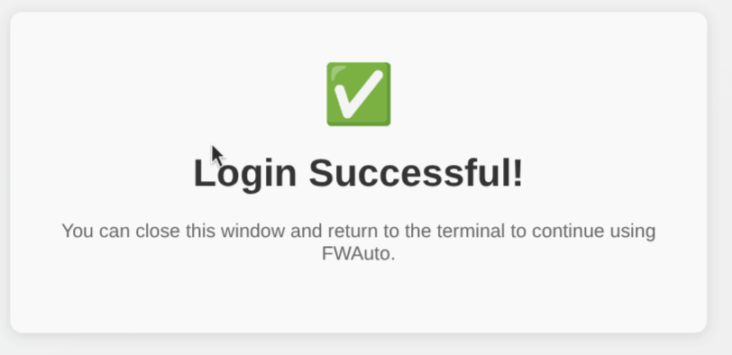

# FWAuto Quickstart Guide

快速上手 FWAuto 韌體開發自動化工具。

## 安裝

1. 向 FWAuto Team 取得 `install.sh`
2. 執行安裝腳本：

   ```bash
   ./install.sh
   ```

   > 腳本會檢查 `uv` 和 `Node.js (>= 20)`，缺少時會提示安裝方式。

3. 驗證安裝：

   ```bash
   fwauto --help
   ```

## 認證

FWAuto 使用 Google OAuth 進行認證：

```bash
fwauto auth login
```

瀏覽器會自動開啟 Google 登入頁面：

**Step 1: 選擇帳戶**



**Step 2: 授權存取**



**Step 3: 登入成功**



完成後即可關閉瀏覽器視窗，返回終端機繼續使用 FWAuto。

查看認證狀態：

```bash
fwauto auth status
```

```
📋 FWAuto Auth Status
========================================
   Status: ✅ Logged in
   User: FWAuto
   Email: fwauto@gmail.com
   Server: https://fwauto-server-xxxxx.run.app
   Dashboard: https://fwauto-server-xxxxx.run.app/dashboard

   Verifying token...                                  Token: ✅ Valid
```

## 專案初始化

進入你的韌體專案目錄，執行任何 fwauto 命令（如 `fwauto build`），系統會自動啟動初始化 Wizard：

```
⚠️  FWAuto project not initialized
🚀 Starting setup wizard (3 step(s))...

[1/3] SDK Configuration
SDK path [/opt/ti-sdk]:

[2/3] Build Configuration
Build type:
  1. makefile
  2. command
Select [1]:

[3/3] Deploy Configuration
Deploy type:
  1. network
  2. serial
  3. command
Select [1]:
```

完成後會建立 `.fwauto/` 目錄：

```
.fwauto/
├── config.toml      # 專案配置
├── build/
│   └── Makefile     # 編譯腳本（需自行修改）
└── logs/            # 日誌目錄
```

## 基本使用

### 編譯

```bash
fwauto build
```

編譯失敗時，AI 會自動嘗試修復（最多 3 次）。

### 部署

```bash
fwauto deploy
```

帶參數部署：

```bash
fwauto deploy --binary-args "on"
```

### 日誌分析

```bash
fwauto log "有任何 error 嗎?"
```

指定日誌檔案：

```bash
fwauto log "分析這份日誌" --log-path /path/to/uart.log
```

### 查看幫助

```bash
fwauto --help
```

```
 Usage: fwauto [OPTIONS] COMMAND [ARGS]...

 🚀 STM32 Firmware Automation Tool with AI

╭─ Commands ───────────────────────────────────────────────────────────────────╮
│ dashboard   🌐 Show or open FWAuto Dashboard.                                │
│ build       🔨 Build firmware project.                                       │
│ deploy      📥 Deploy firmware to device.                                    │
│ log         📊 Analyze UART log files using AI.                              │
│ help        ❓ Show help information.                                        │
╰──────────────────────────────────────────────────────────────────────────────╯
```

## 聊天模式

直接執行 `fwauto` 進入互動式聊天：

```bash
fwauto
```

或帶訊息啟動：

```bash
fwauto "讓 LED 快速閃爍"
```

### 觸發方式

聊天模式支援兩種觸發方式：

| 方式 | 說明 | 範例 |
| ---- | ---- | ---- |
| 顯式 | 使用 Slash Commands | `/build`、`/deploy` |
| 隱式 | 口語化描述 | 「幫我編譯」、「部署到開發板」 |

### Slash Commands

| 命令      | 功能     |
| --------- | -------- |
| `/build`  | 執行編譯 |
| `/deploy` | 部署韌體 |
| `/log`    | 分析日誌 |
| `/help`   | 顯示幫助 |
| `/exit`   | 結束聊天 |

---

## 附錄 A: AM62X 開發板

### config.toml 範例

```toml
[project]
name = "my-am62x-project"

[sdk]
path = "/home/alientek/ATK-AM62x-SDK"

[build]
type = "makefile"
makefile = ".fwauto/build/Makefile"
target = "build"

[deploy]
type = "network"

[deployment]
board_ip = "192.168.50.169"
board_user = "root"
deploy_path = "/home/root"
```

---

## 附錄 B: Arduino

### config.toml 範例

```toml
[project]
name = "Blink"

[sdk]
path = "~/.arduino15"

[build]
type = "command"
command = "arduino-cli compile --fqbn arduino:avr:nano ."

[deploy]
type = "command"
command = "arduino-cli upload -p /dev/ttyUSB0 --fqbn arduino:avr:nano ."

[log]
type = "serial"
serial_port = "/dev/ttyUSB0"
baudrate = 9600
```

---

## 附錄 C: Makefile 撰寫規範

選擇 `makefile` 類型時，系統會複製 template 到 `.fwauto/build/Makefile`。**你需要根據專案需求修改**。

**必要規範**：

| 規範                | 說明                                     |
| ------------------- | ---------------------------------------- |
| 必須有指定的 target | 預設 `build`，可在 config.toml 修改      |
| Return code         | 成功 = 0，失敗 = 非 0                    |
| 輸出                | stdout/stderr 會被捕捉，用於 AI 分析錯誤 |

**需修改的變數**（以 AM62X 為例）：

| 變數        | 用途             |
| ----------- | ---------------- |
| `ARAGO_ENV` | SDK 環境設定路徑 |
| `SYSROOT`   | 交叉編譯 sysroot |
| `CC`        | 編譯器           |
| `SRC_DIR`   | 源碼目錄         |
| `BUILD_DIR` | 輸出目錄         |

---

## 常見問題

### 認證失敗

```bash
fwauto auth logout
fwauto auth login
```

### 找不到 .fwauto/

確認你在專案目錄或其子目錄中執行命令。FWAuto 會向上搜尋 `.fwauto/` 目錄。

### 編譯錯誤不進入 AI 修復

配置錯誤（如 Makefile 不存在）不會觸發 AI 修復。檢查錯誤訊息，確認是編譯錯誤而非配置問題。
